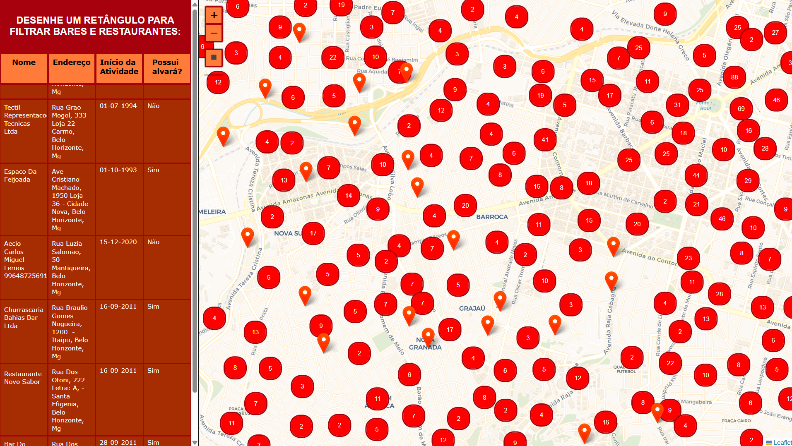
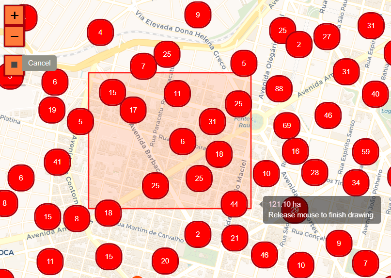
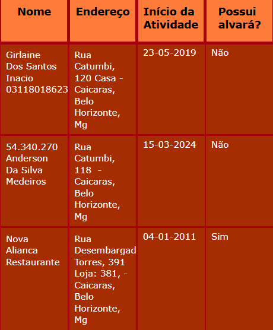
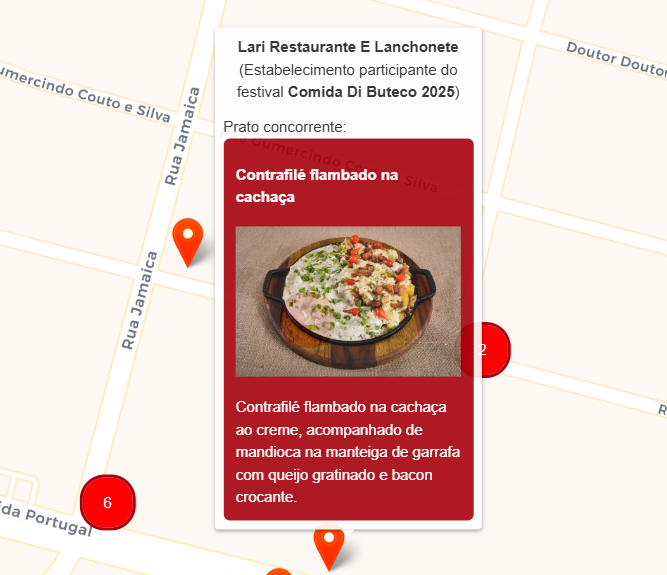

# Trabalho Prático de Algoritmos 2: Geometria Computacional
Este repositório contém a implementação de um trabalho prático da disciplina Algoritmos 2 - UFMG que aborda os aspectos práticos dos algoritmos de geometria computacional. Especificamente, são explorados aspectos de implementação de árvores k-dimensionais para realização de busca ortogonal em conjuntos de pontos. 

Além de trabalhar aspectos teóricos, este projeto envolve a integração de bibliotecas de manipulação e plotagem de mapas e dados geográficos, assim como pratica o tratamento de bases reais.

# [Página interativa](https://alg2-tp1-b7ke.onrender.com)

## Bases de dados utilizadas
- Base de atividades econômicas da PBH (2025-04-01): https://dados.pbh.gov.br/dataset/atividades-economicas1
- Restaurantes concorrentes do festival Comida di Buteco: https://comidadibuteco.com.br/butecos/belo-horizonte/

## O que é?
A partir desse projeto é possível explorar as informações de todos os bares e restaurantes do município de Belo Horizonte, filtrando-os por região. Além disso, é possível visualizar os pratos competidores daqueles estabelecimentos participantes do festival Comida Di Buteco de 2025.

## Utilização
Esta aplicação pode ser utilizada a partir da interface de usuário a seguir:

No lado esquerdo, é possível observar uma tabela que, inicialmente, lista algumas informações de todos os restaurantes e bares cadastrados no site da prefeitura.
Já no lado direito, é possível observar a localização de todos os estabelecimentos no mapa do município. É possível mover o mapa arrastando a tela e controlar o zoom a partir dos botões no canto superior esquerdo.

### Filtrando estabelecimentos
Para filtrar os estabelecimentos por região, basta clicar no botão de desenho de retângulo  e começar a delimitar a área escolhida, com dois cliques no mapa. Um exemplo dessa interação pode ser visto na imagem abaixo:

Após desenhar a área retangular, a busca será realizada em uma 2-D Tree. O resultado da busca será exibido em uma nova tabela na secção da esquerda. Assim como na tabela inicial, com todos os estabelecimentos, é possível reordenar as colunas e rolar a tabela para visualizar as informações de todos os bares e restaurantes encontrados na área desenhada: 

### Desfazendo o filtro
Para desfazer um filtro criado, é possível desenhar outro filtro. Para desfazer todos, basta recarregar a página.

### Vendo os pratos concorrentes do Comida Di Buteco 2025
Ao passar o mouse por cima dos marcadores no mapa (hover), é possível observar os nomes de cada estabelecimento. Porém, alguns dos restaurantes e bares de Belo Horizonte estão participando do festival Comida Di Buteco 2025. Ao passar o mouse sobre eles, é possível visualizar as informações básicas do prato concorrente no festival, assim como a sua imagem, publicada no site oficial:

## Ferramentas utilzadas
- Python3: https://www.python.org/
- OpenStreetMap: https://www.openstreetmap.org/
- Plotly: https://plotly.com/python/table-subplots/
- Dash Leaflet: https://www.dash-leaflet.com/
- CartoDBBasemapStyles: https://github.com/CartoDB/basemap-styles
- Python requests: https://pypi.org/project/requests/
- BeautifulSoup: https://pypi.org/project/beautifulsoup4/
- Urllib: https://docs.python.org/3/library/urllib.html
